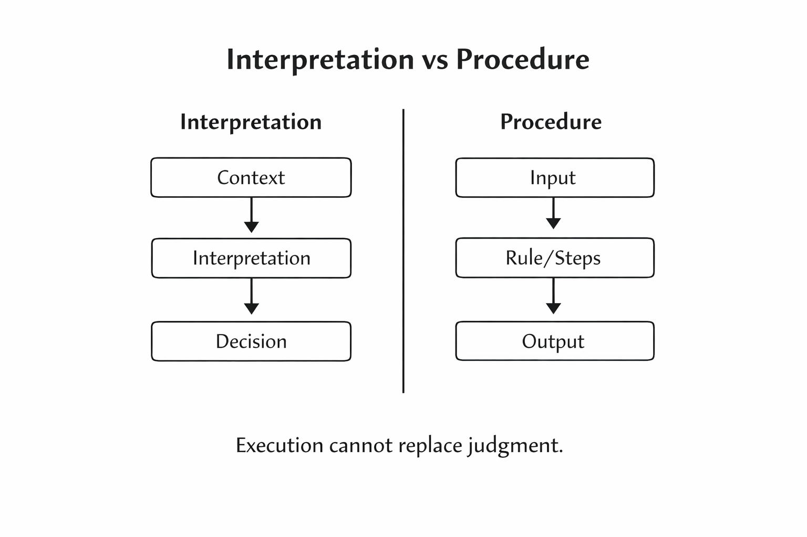
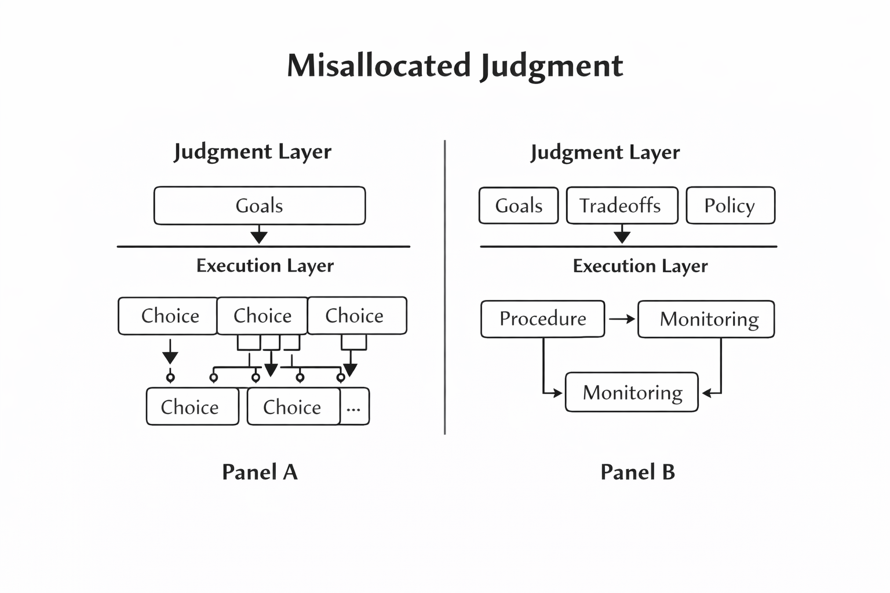
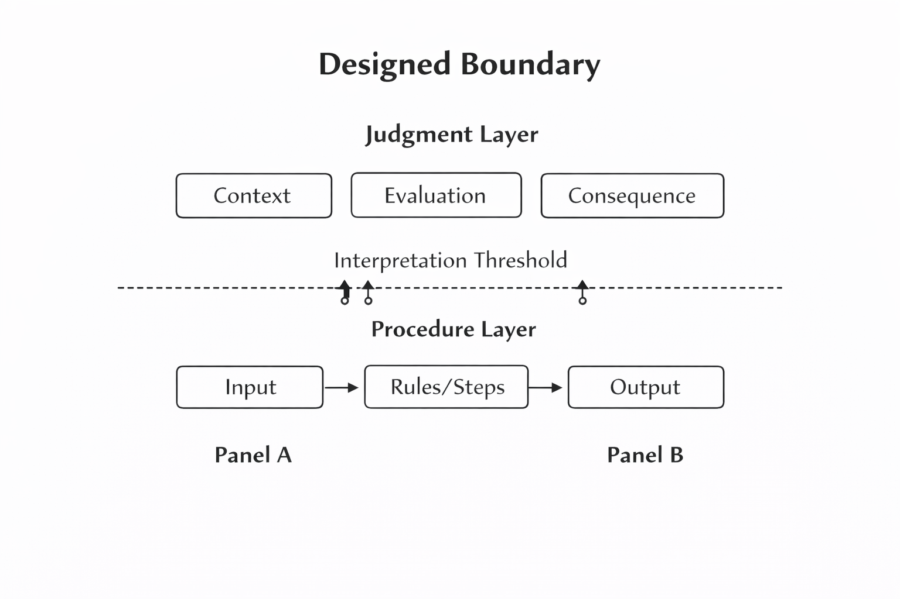
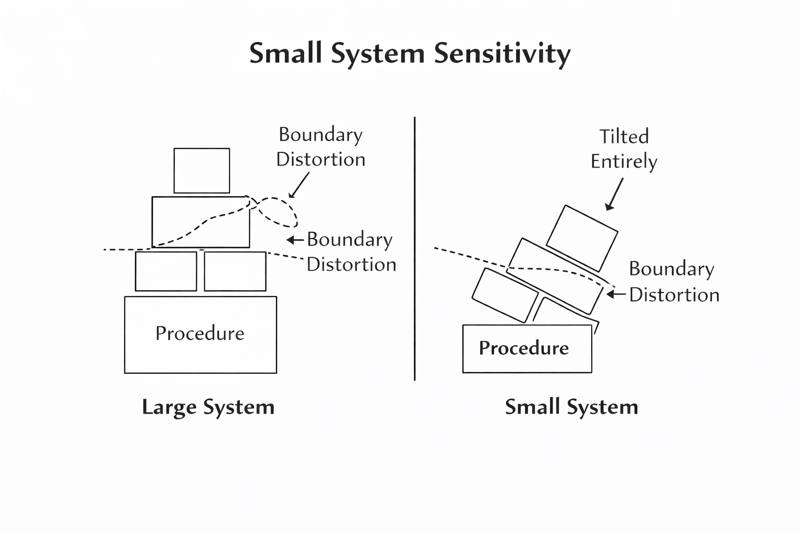

## Chapter 7 — Human Judgment vs. Machine Execution

Modern systems operate at a scale and speed that make execution increasingly inexpensive. Procedures can be replicated, distributed, and repeated with minimal marginal cost. Instructions, once clarified, propagate reliably. As a result, the act of doing is no longer the primary constraint in many environments.

Judgment, however, does not scale in the same way. Judgment interprets context, weighs tradeoffs, and absorbs consequences. It determines which objectives matter, which signals to trust, and which risks to accept. Where execution applies established logic, judgment decides which logic is appropriate. It operates under ambiguity and remains accountable for outcomes that cannot be fully specified in advance.

Confusing these two functions creates structural instability. When execution is treated as judgment, systems rigidly apply procedures in situations that require interpretation. When judgment is treated as execution, interpretive decisions become fragmented, duplicated, or automated beyond their design boundary.

The central tension, then, is not between humans and machines, nor between intuition and automation. It is between two different types of work: one that scales through repetition, and one that anchors meaning under uncertainty. Stability depends on preserving the distinction.

One scales. The other does not. Mixing them is where most AI-native teams break.

One scales. The other does not. Mixing them is where most AI-native teams break.

---

### 7.1 Judgment and Execution Are Not the Same

Execution operates within defined parameters. It follows instructions, applies rules, and produces outputs that are expected to conform to a specification. When the inputs are known and the procedure is stable, execution can be evaluated against consistency and efficiency. Its success depends on clarity of instruction and reliability of repetition.

Judgment operates before those parameters are fully defined. It determines which objectives are worth pursuing, which tradeoffs are acceptable, and which uncertainties are tolerable. Where execution asks *how* to proceed, judgment asks *whether* to proceed, and under what conditions. It interprets incomplete information and remains accountable for consequences that cannot be entirely predicted.

These two functions differ not only in content but in structure. Execution scales by reducing variation. Judgment does not scale through replication in the same way. Each context introduces nuance. Each decision carries implications that may alter the system itself. Judgment therefore absorbs ambiguity rather than eliminating it.

Because execution can be formalized, it lends itself to measurement. Judgment is evaluated differently. Its quality is revealed over time, through the coherence of outcomes and the absence of unintended consequences. It cannot be reduced to procedural compliance without losing its function.

Confusion begins when systems assume that clearer procedures can replace interpretive responsibility. When interpretive questions are forced into procedural templates, choices appear consistent but drift from context. Conversely, when procedural matters are repeatedly escalated to judgment, interpretive capacity becomes overloaded.

Judgment and execution also differ in their relationship to consequence. Execution produces results within a predefined frame; if the frame is correct, the output is predictable. Judgment shapes the frame itself. It defines the objectives that execution serves and the constraints it must respect. When judgment fails, execution can amplify that failure at scale.

> **Figure 7.1 — Interpretation vs. Procedure**
>
>
> 
>
>
> *The line between interpretation and procedure is not about task difficulty — it is about frame-setting versus frame-operating. Blurring the boundary either rigidifies judgment into outdated rules or floods decision-makers with routine questions.*

The stability of a modern system depends less on how efficiently it executes and more on how precisely it distinguishes between deciding and doing. When that boundary is preserved, execution reinforces intent. When it is blurred, scale magnifies error.

---

### 7.2 Where Teams Go Wrong

Misallocation between judgment and execution rarely appears dramatic at first. It begins with small substitutions. A repeated task is treated as if it still requires interpretation. A contextual decision is embedded into procedure without recognizing that its assumptions remain unstable.

One common failure is over-centralizing judgment. When interpretive authority is concentrated excessively, execution becomes dependent on continual approval. Decisions bottleneck not because they are complex, but because the boundary between thinking and doing has collapsed upward.

The opposite failure is proceduralizing unstable domains. Decisions that require context are reduced to rules because rules scale more easily. What appears efficient initially becomes fragile. Execution continues confidently while environmental conditions shift.

> **Figure 7.2 — Misallocated Judgment**
>
>
> 
>
>
> *Each misallocation produces a predictable failure pattern. Diagnosis requires identifying not just that judgment is failing, but which structural misplacement is causing it.*

A subtler misallocation occurs when judgment is distributed without clarity. Multiple actors reinterpret the same signals without a defined locus of consequence. In such systems, disagreement is not resolved structurally but diffused socially. Execution receives inconsistent inputs. Actions oscillate.

Teams also misallocate by embedding judgment inside execution layers. Operational processes begin to encode assumptions that no longer receive periodic review. What was once a deliberate decision becomes a default behavior. The system loses the ability to distinguish between choice and habit.

In each of these cases, the problem is not individual capability. It is boundary confusion. When judgment and execution are not clearly separated, responsibility diffuses, feedback weakens, and drift accelerates.

*If drift, overload, or inconsistency appear in your system, are they symptoms of effort — or of a boundary that was never deliberately defined?*

---

### 7.3 Designing the Boundary Deliberately

The boundary between judgment and execution does not emerge automatically. It is shaped, often implicitly, by habits, incentives, and inherited structures. When left undefined, it shifts under pressure. Ambiguity accumulates, and responsibility drifts to whichever layer absorbs it with the least resistance.

Design begins with recognizing that judgment and execution have different failure modes. Execution fails through inconsistency or error in application. Judgment fails through misinterpretation of context or misalignment of intent. Because these failures differ, the system must specify where interpretive authority ends and procedural repetition begins.

A deliberately designed boundary clarifies which decisions define the frame within which action occurs. It distinguishes between defining objectives and pursuing them, between setting constraints and operating inside them. This determines where escalation occurs, where feedback returns, and where accountability resides.

If the boundary is drawn too low, interpretive responsibility becomes embedded in procedures. Rules expand to cover conditions they were never meant to govern. If the boundary is drawn too high, procedural matters repeatedly demand interpretive review. Execution becomes dependent on discretionary approval. The system slows.

Deliberate design also requires deciding what must remain fluid and what must become fixed. Certain elements of a system should be stable enough to scale without reinterpretation. Others must remain sensitive to context and consequence.

Feedback loops also depend on this boundary. Signals generated through execution must reach the interpretive layer when assumptions no longer hold. If feedback circulates only within procedures, adaptation is delayed.

> **Figure 7.3 — Small System Sensitivity**
>
>
> 
>
>
> *Small teams have no structural buffering between design and consequence. A misplaced judgment boundary that might take months to surface in a large organization will appear in days in a six-person team. This is a feature, not a liability — it forces structural clarity early.*

Over time, the boundary itself must remain visible. Systems that do not articulate it tend to blur it gradually. Without periodic clarity about which layer owns which calls, the distinction erodes.

As execution becomes more scalable and inexpensive, the consequences of boundary design intensify. The more a system can do, the more costly it becomes to do the wrong thing consistently. Clarity about where judgment resides is therefore not a philosophical preference but a architectural requirement.

---

### 7.4 Implications for Small Teams

In constrained configurations, the distinction between judgment and execution becomes more consequential. Interpretive capacity is limited not by authority but by attention. When the same individuals participate in both defining intent and carrying out tasks, boundary clarity is harder to preserve and more costly to ignore.

In larger systems, misallocated judgment can be absorbed for a time. Redundant layers and distributed responsibility dampen the immediate impact of boundary confusion. In smaller configurations, misplacement is felt directly. If interpretive decisions are embedded too deeply in procedures, there may be no separate layer available to reconsider them.

Conversely, when routine matters are repeatedly escalated to interpretation, the limited pool of judgment becomes saturated. A small number of people must weigh context, consequences, and tradeoffs across many domains. Over time, this concentration produces delay. Execution waits for clarification, and momentum erodes.

The cost is not only temporary. Misplaced judgment also alters learning. When interpretive responsibility is unclear, feedback cannot find its target. If outcomes reflect flawed framing but are treated as procedural mistakes, correction occurs in the wrong place.

Small configurations are especially sensitive to this misdirection. There is less distance between decision and consequence. Errors propagate quickly because there are fewer buffers. The same foundational simplicity that enables speed also amplifies boundary errors.

Another pressure arises from role compression. In constrained teams, individuals often inhabit multiple functions simultaneously. Without explicit clarity about which mode is active, tradeoffs oscillate between over-formalization and over-discretion.

As execution becomes increasingly scalable, the leverage of judgment grows. In a constrained configuration, a single misframed decision can redirect a substantial portion of effort. The boundary between deciding and doing therefore becomes a central design question.

*If interpretive capacity is scarce and execution is amplifying, how does a constrained team ensure that judgment remains both protected and properly placed?*

---

### 7.5 Leadership in a Judgment-Heavy System

In systems where execution is increasingly procedural, leadership shifts toward stewardship of judgment. Authority no longer resides primarily in directing tasks. It resides in determining where interpretation must occur and where it must not. The central responsibility becomes boundary maintenance.

A judgment-heavy system does not mean constant decision-making. It means that the few decisions requiring contextual evaluation are recognized as structurally significant. Leadership defines which assumptions are stable enough to proceduralize and which remain contingent.

Stewardship of judgment also involves managing escalation. If every uncertainty rises to the top, the system becomes brittle. If none do, drift accumulates invisibly. Effective leadership defines thresholds — conditions under which reinterpretation must occur and conditions under which execution continues uninterrupted.

Another responsibility is protecting judgment from operational noise. As execution scales, the volume of signals increases. Without filtration, leaders become absorbed in procedural detail, mistaking activity for significance.

Leadership must also ensure that judgment is accountable. When interpretive authority exists without consequence, ambiguity persists. Decisions require ownership not to concentrate power, but to maintain clarity about who bears the cost of misinterpretation.

Importantly, leadership does not monopolize judgment. It designs where judgment resides. The function of leadership is to maintain coherence across these allocations so that boundaries remain explicit rather than implicit.

> **Figure 7.4 — Leadership in a Judgment-Heavy System**
>
>
> 
>
>
> *In a judgment-heavy system, leadership effectiveness is measured not by decision speed but by whether judgment allocation remains deliberately designed and maintained. Leadership that only decides is a bottleneck. Leadership that designs how decisions are made is a multiplier.*

As systems become more capable of automated execution, the relative weight of judgment increases. Errors at the interpretive layer propagate farther and faster. Leadership therefore becomes less about directing motion and more about ensuring that the system knows when to reconsider its premises.

*In a judgment-heavy system, the question is not who decides most often, but whether the boundary between deciding and doing remains deliberate, visible, and correct.*

---

### 7.6 The Question This Chapter Leaves You With

Execution is becoming easier to scale. Procedures can be replicated with precision. Output can increase without proportional increases in effort. In such an environment, the scarcity shifts quietly toward interpretation. What cannot be replicated as easily is the act of defining intent under uncertainty.

The distinction between judgment and execution is structural rather than philosophical. One defines the frame; the other operates within it. One absorbs consequence; the other applies logic. The stability of the system depends on knowing where one ends and the other begins.

The difficulty is that boundaries are rarely explicit. Interpretive judgments hide inside procedures. Routine matters escalate into discretionary debate. Feedback circulates without reaching the layer that can adjust assumptions.

If execution in your system is highly capable, what is it amplifying? If interpretive authority is concentrated, is it protected from procedural noise? If it is distributed, is it coherent or fragmented?

*Before considering tools, structures, or adjustments, a more basic inquiry remains: where does judgment currently reside in your system, and is that placement deliberate?*

---

**In Practice: Boeing 737 MAX — Execution Without Judgment**

The Boeing 737 MAX crashes of 2018 and 2019 are a case study in judgment-execution boundary failure. The MCAS safety system — designed to correct for aerodynamic instability — was treated as an execution problem (automated control) when it required judgment (pilot-visible, pilot-overridable decision authority). Certification processes, designed for earlier aircraft generations, proceduralized an assumption that stall scenarios would be rare edge cases. They were not. When MCAS activated incorrectly, pilots lacked the contextual information to override it — not because they weren't capable, but because the boundary between automated execution and human judgment had been deliberately obscured to avoid costly retraining. 346 people died. The planes were grounded for 20 months. The cost exceeded $20 billion. The engineering was sophisticated. The frame around it was not.

---

::: {.takeaways}
**Key Takeaways**

- Judgment — interpreting meaning, resolving ambiguity, owning uncertainty — cannot be automated. It can only be abdicated, which is a different and more dangerous outcome.
- The core failure mode is not AI replacing humans. It is teams assigning judgment responsibilities to machine execution and only noticing when consequences arrive.
- The boundary between judgment and execution must be designed deliberately. Left undesigned, it drifts toward whatever produces the fastest output — not the best choice.
- Highly capable execution systems make poor judgment placement more consequential, not less. Speed amplifies direction.
- Leaders are accountable for where judgment resides in the team — not just for the quality of their own decisions, but for the conditions under which all decisions are made.
:::

